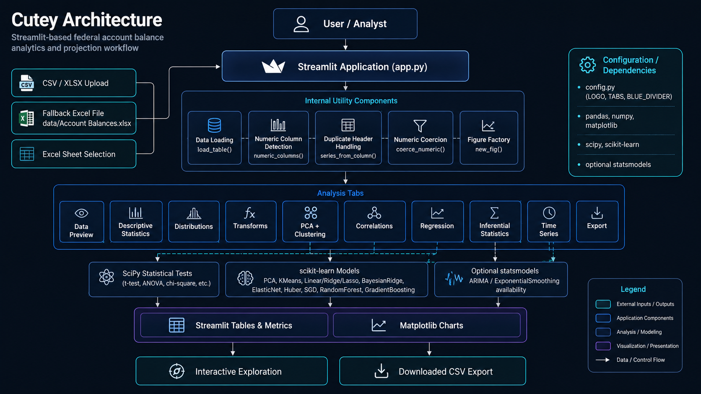

___

Cutey uses a compact Streamlit architecture organized around one application entry point, a loaded pandas dataframe, helper utilities, analytical tabs, matplotlib visualizations, and a CSV export path.

## 🧭 Purpose

This page explains how the application moves from user-provided data to analytical outputs. It is written for developers and analysts who need to understand where data enters the application, how the dataframe is prepared, and how each tab contributes to the balance-projection workflow.

## 🧱 Architectural Overview

```text
User / Analyst
    |
    v
Streamlit Sidebar
    |
    +-- Uploaded CSV/XLSX/XLS
    +-- Fallback data/Account Balances.xlsx
    |
    v
Data Loading Layer
    |
    +-- list_excel_sheets_from_upload()
    +-- list_excel_sheets_from_path()
    +-- load_table()
    |
    v
Working pandas DataFrame
    |
    +-- numeric_columns()
    +-- series_from_column()
    +-- coerce_numeric()
    |
    v
Streamlit Analytical Tabs
    |
    +-- Data Preview
    +-- Descriptive Statistics
    +-- Distributions
    +-- Transformations
    +-- PCA + Clustering
    +-- Correlations
    +-- Regression
    +-- Inferential Statistics
    +-- Time Series
    +-- Export
    |
    v
Tables, Metrics, Charts, and CSV Download
```

## 🧩 Source Organization

The current implementation is concentrated in `app.py`.

| Area | Source Pattern | Responsibility |
|---|---|---|
| Imports | Top of `app.py` | Loads Streamlit, pandas, NumPy, SciPy, matplotlib, scikit-learn, and optional statsmodels. |
| Constants | Global constants | Defines fallback file path, colors, markers, line styles, and UI dividers. |
| Utility functions | Top-level helper functions | Provide numeric inference, figure creation, duplicate-header handling, numeric coercion, sheet listing, and table loading. |
| Sidebar | Streamlit sidebar block | Handles file upload, sheet selection, loading status, and duplicate-header warning. |
| Tabs | `st.tabs(cfg.TABS)` | Defines the user-facing analytical workflow. |
| Export | Final tab | Downloads the working dataframe as CSV. |

## 📥 Input Layer

Cutey accepts either a user upload or a fallback Excel file.

| Input Path | Behavior |
|---|---|
| Uploaded `.csv` | Loaded with `pandas.read_csv`. |
| Uploaded `.xlsx` or `.xls` | Sheet names are inspected and the selected sheet is loaded with `pandas.read_excel`. |
| No upload | Loads `data/Account Balances.xlsx` when present. |
| Unsupported upload | Raises an unsupported-file error. |

## 🧹 Data Preparation Layer

The application includes three important preparation helpers.

| Helper | Role |
|---|---|
| `numeric_columns()` | Finds typed numeric columns or infers columns that are mostly numeric after coercion. |
| `series_from_column()` | Returns a one-dimensional series even when duplicate headers cause pandas to return a dataframe. |
| `coerce_numeric()` | Converts selected columns to numeric using safe coercion. |

These helpers support the rest of the application by keeping statistical and machine-learning operations aligned to one-dimensional numeric inputs.

## 📊 Analytical Workflow Layer

The tabs are arranged as an analyst workflow rather than as isolated features.

| Tab | Architectural Role |
|---|---|
| Data | Shows raw dataframe shape, values, and data types. |
| Descriptive Stats | Summarizes numeric columns before deeper analysis. |
| Distributions | Visualizes distribution shape and normality. |
| Transforms | Creates transformed numeric views for scaled or skewed values. |
| PCA + Clustering | Reduces numeric fields and groups observations. |
| Correlations | Measures relationships among selected numeric fields. |
| Regression | Compares predictive estimators and diagnostic plots. |
| Inferential Stats | Tests assumptions and group differences. |
| Time Series | Aggregates numeric values by period-like fields. |
| Export | Produces a CSV version of the loaded dataframe. |

## 📈 Visualization Layer

Cutey uses matplotlib figures rendered through Streamlit.

| Visualization | Produced By |
|---|---|
| Grouped bar chart | Descriptive Stats tab |
| Histograms | Distributions tab |
| Q-Q plot | Distributions tab |
| PCA scatter plot | PCA + Clustering tab |
| Correlation heatmap | Correlations tab |
| Actual vs predicted scatter | Regression tab |
| Residuals vs predicted scatter | Regression tab |
| Period trend lines | Time Series tab |

## 🧪 Modeling Layer

The regression tab compares several scikit-learn estimators using a common train/test split and shared metrics.

| Estimator Family | Models |
|---|---|
| Linear models | Linear Regression, Ridge, Lasso, Bayesian Ridge, ElasticNet |
| Robust / iterative models | HuberRegressor, SGDRegressor |
| Ensemble models | RandomForestRegressor, GradientBoostingRegressor |

The architecture favors transparent comparison over hidden automation. This keeps the modeling workflow understandable for financial and budget-analysis users.

## 🕰️ Time-Series Layer

The time-series tab is enabled when `statsmodels` is installed. The current visible workflow focuses on period detection, grouping, summation, and trend visualization. Although ARIMA and Exponential Smoothing are imported, documentation should describe implemented behavior as period-based trend analysis unless forecasting controls are added to the application.

## 📤 Output Layer

The export tab produces:

```text
balance_projection_export.csv
```

The export uses the loaded dataframe. It does not currently export every derived table, chart, model result, or diagnostic artifact.

## ✅ Design Principles

| Principle | Implementation |
|---|---|
| Local-first analytics | Data is loaded into the Streamlit runtime and processed locally. |
| Transparent workflow | Tabs expose each analytical stage directly. |
| Conservative preprocessing | Numeric coercion is explicit and safe. |
| Duplicate-header resilience | Duplicate column names are detected and handled where needed. |
| Analyst control | Users choose columns, transformations, methods, targets, and period fields. |
| Documentation-ready structure | Helper functions can be documented through mkdocstrings. |

## 🔗 Related Pages

- [Data Sources](data-sources.md)
- [User Guide](user-guide/index.md)
- [Application API](api/app.md)
- [Development](development.md)
