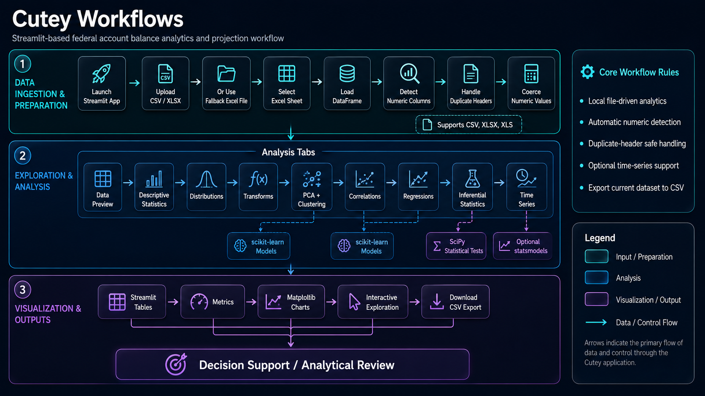

___

The Cutey user guide follows the same order as the Streamlit application tabs. Use it as an operational walkthrough from data loading through export.

## 🧭 Purpose

This guide helps analysts run Cutey consistently, understand each tab, and avoid common data-preparation mistakes before interpreting statistical or machine-learning outputs.

## ✅ Recommended Sequence

| Step | Page | Action |
|---:|---|---|
| 1 | [Installation](installation.md) | Set up Python dependencies and run Streamlit. |
| 2 | [Data Loading](data-loading.md) | Upload CSV or Excel data, or use the fallback workbook. |
| 3 | [Data Overview](data-overview.md) | Inspect rows, columns, and data types. |
| 4 | [Descriptive Statistics](descriptive-statistics.md) | Review summary statistics and missingness. |
| 5 | [Distributions](distributions.md) | Examine histograms and Q-Q plots. |
| 6 | [Transformations](transformations.md) | Apply scaling or log transformation when appropriate. |
| 7 | [PCA & Clustering](pca-clustering.md) | Explore structure and groups in numeric data. |
| 8 | [Correlations](correlations.md) | Review pairwise relationships. |
| 9 | [Regression](regression.md) | Compare predictive models and diagnostics. |
| 10 | [Inferential Statistics](inferential-statistics.md) | Test normality, confidence intervals, and group differences. |
| 11 | [Time Series](time-series.md) | Aggregate values by year, period, or availability field. |
| 12 | [Export](export.md) | Download the working dataframe. |

## 🧱 Workflow Position

```text
Install -> Load Data -> Inspect -> Summarize -> Diagnose -> Transform
        -> Explore -> Model -> Test -> Trend -> Export
```

## 🧪 Practical Guidance

Use the early tabs before the modeling tabs. Regression, clustering, and inferential tests are more meaningful when the dataset has already been reviewed for missing values, duplicate headers, scale differences, skew, and obvious data-quality problems.

## 🔗 Related Pages

- [Architecture](../architecture.md)
- [Data Sources](../data-sources.md)
- [Development](../development.md)
